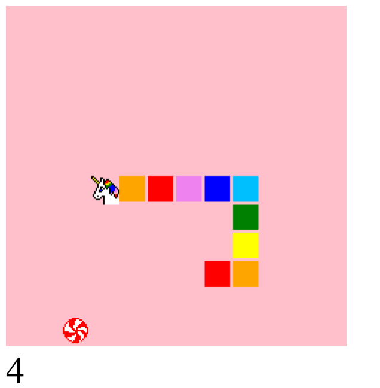

# 🦄 Unicorn Snake Game

A fun browser-based snake game with a unicorn-themed pixel art twist. Collect candy and watch your unicorn tail grow!

---

## 📸 Screenshot

---

## ⚙️ Features

* Classic Snake mechanics
* Unicorn and candy pixel art graphics
* Score tracking
* Arrow key controls
* Colorful tail animation

---

## 🧩 File Structure

index.html       # Main HTML file with canvas
script.js        # Game logic and drawing
style.css        # Optional CSS for layout

---

## 🚀 How to Play

1. Open `index.html` in a modern browser.
2. Use **arrow keys** to move the snake.
3. Collect the candy to grow your tail.
4. Avoid colliding with yourself.
5. Watch your unicorn grow as you score points!

---

## 🧠 Tech Stack

* HTML5 Canvas
* Vanilla JavaScript
* CSS3 for styling

---

## ⚠️ Notes

* The canvas size is fixed at 456x456 pixels.
* Tail length resets to 5 on self-collision.
* Game updates every 200ms.
